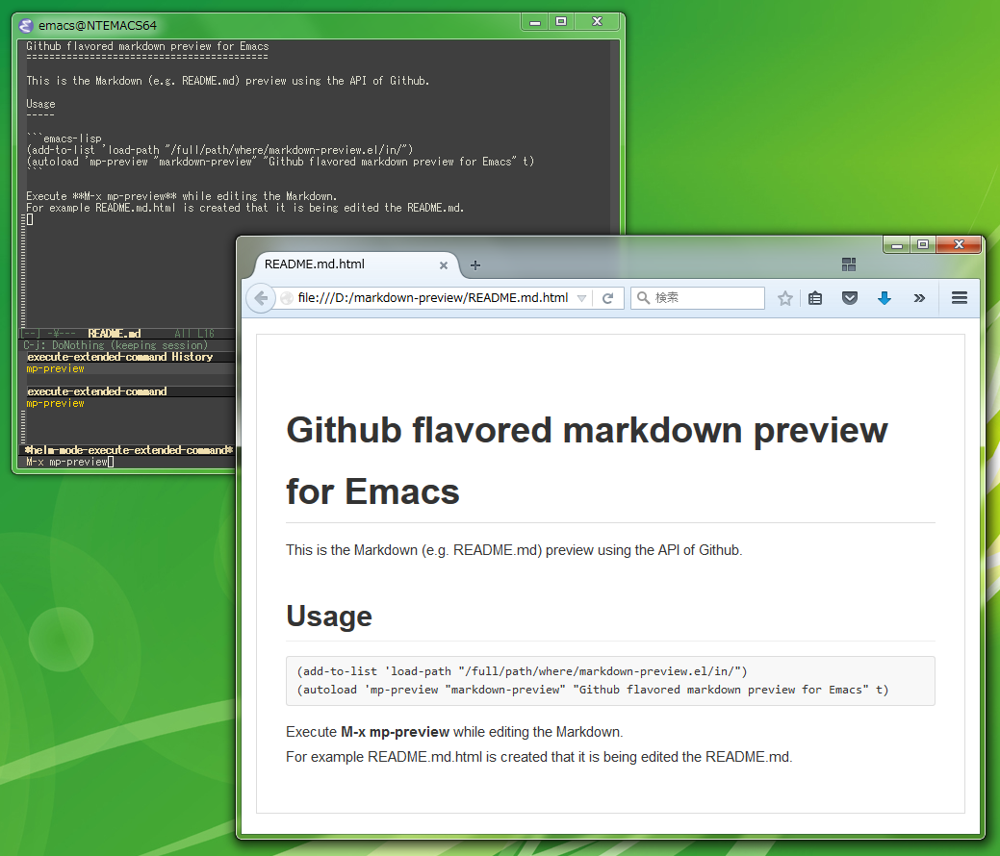

Github flavored markdown preview for Emacs
==========================================

This is the Markdown (e.g. README.md) preview using the API of Github.

Usage
-----

```emacs-lisp
(add-to-list 'load-path "/full/path/where/markdown-preview.el/in/")
(autoload 'mp-preview "markdown-preview" "Github flavored markdown preview for Emacs" t)
```

Execute **M-x mp-preview** while editing the Markdown.  
For example README.md.html is created that it is being edited the README.md.


